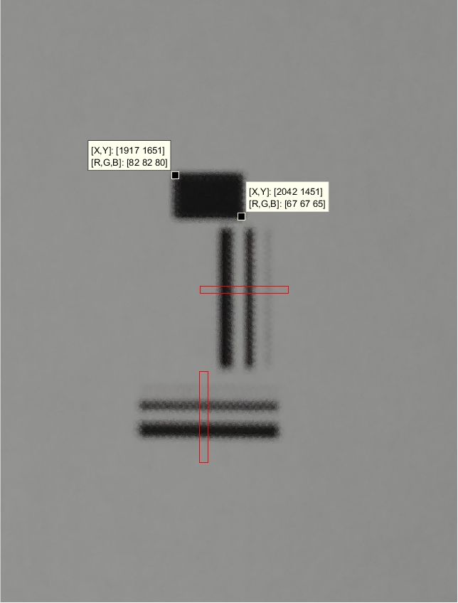
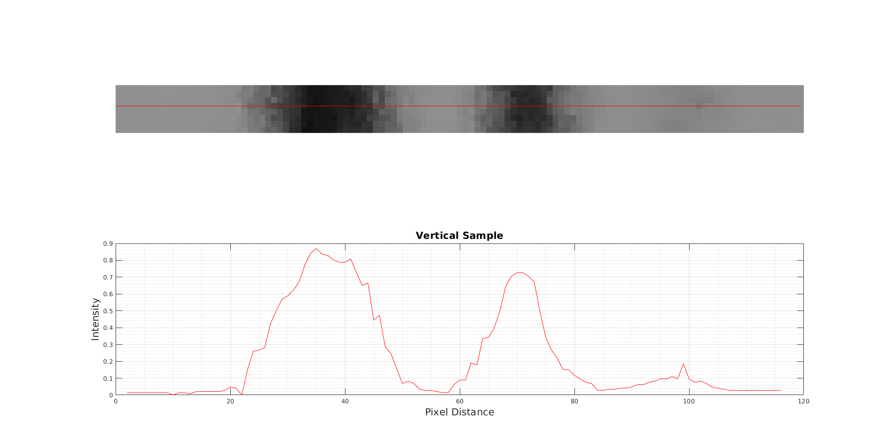
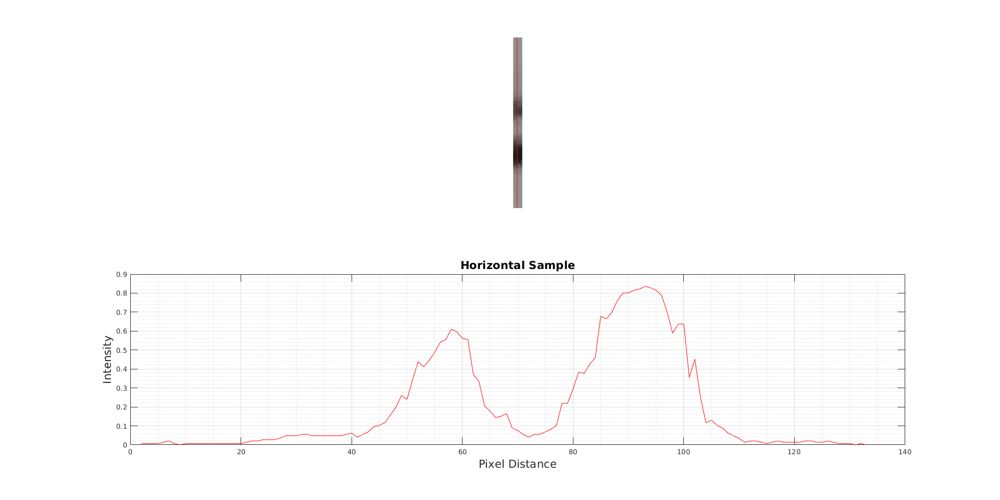
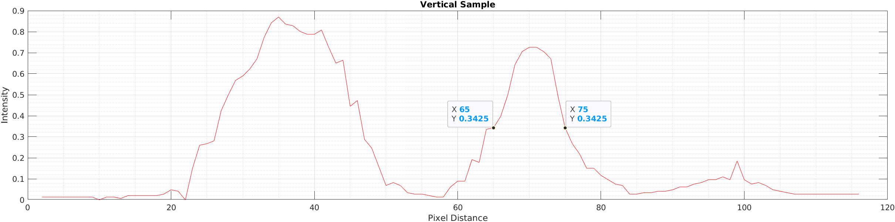
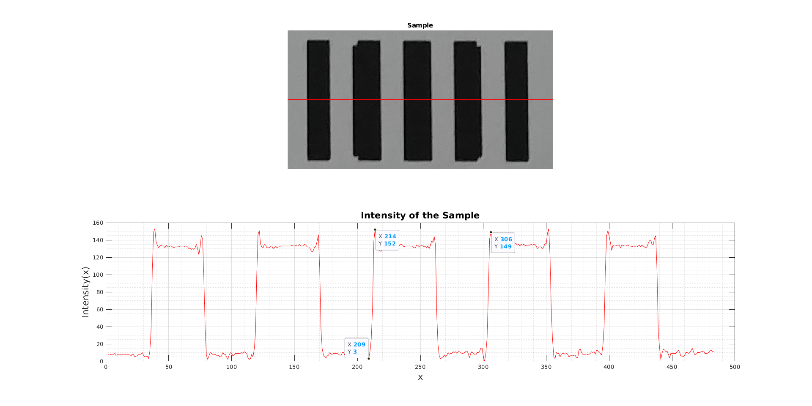
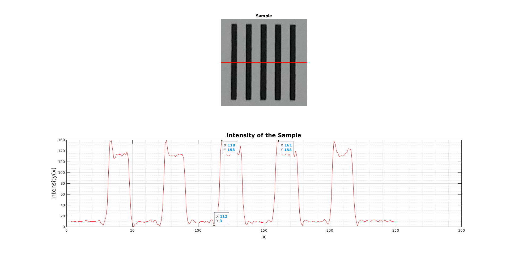
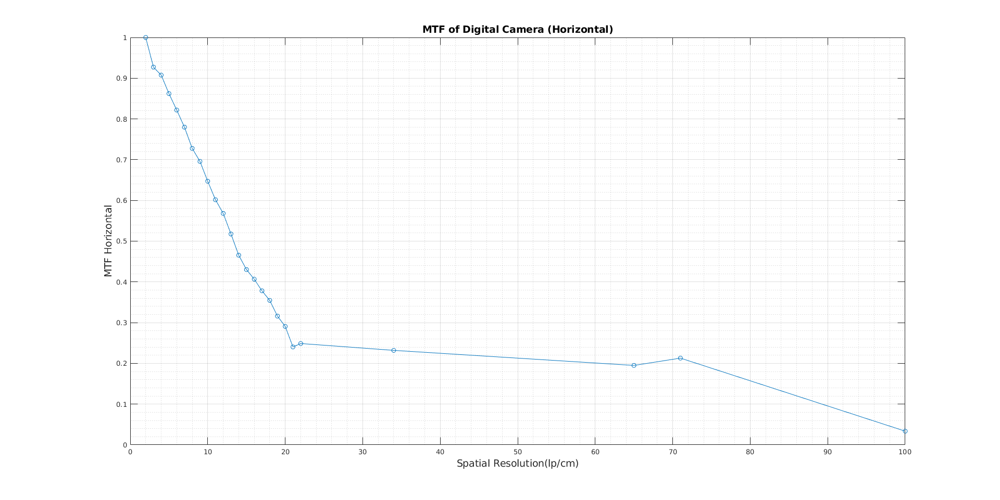
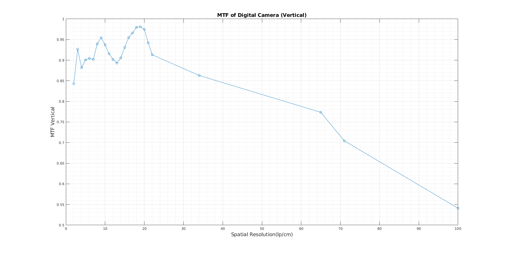

# Measurement-of-LSF-and-MTF-of-a-Digital-Camera

## Introduction
### Summary
In this work, I tried to find the Line Spread Function(LSF) and Modulation Transfer Function(MTF) of my smartphone. Objects are designed in Mathematica 12.1.1 program. For LSF I designed equidistant objects (binarized white and black stripes) with different widths and for MTF I designed equidistant objects (binarized white and black stripes) with the same and various widths in actual size. Actual size means computer designs based on pixels, I designed objects in real-life measure mm unit. Then I printed the objects with dimensions in mm. Then I take pictures of the objects with my smartphone camera in Automatic mode, without using zoom or flashlight and I save images as RAW JPEG and transferred them to my computer with a data cable for eliminating data loss. To analyse the images I take small samples from images by using paint. Because the whole image contains a lot of information and I do not have enough computing power for that. Samples analyzed in MATLAB R2020a. By plotting graphs intensities of pixels of grayscaled images versus pixels, I have calculated LSF and MTF.

## Line Spread Function(LSF)

### Methods of Experiment

A test image (Figure 1) is prepared in Mathematica 12.1.1. All objects are in actual size. This test image includes three vertical and horizontal lines with widths of 1mm, 0.5mm and 0.1mm and one rectangle of 5mm × 3mm. First I created equally distant stripes in actual size, then changed the widths of the stripes.

### Mathematica Code For Real Size Object Generation
```Mathematica
mm = 7.2/2.54; (*Convert pixel to mm*)
a = {0, 5, 6, 7, 7.5, 8.5} mm; (*widths*)
c = {5, 6, 7, 7.5, 8.5, 8.6} mm;
b = 0 mm;
d = 10 mm;
color = {White, Black, White, Black, White, Black};
(*By using this method we can control widths of 
the stripes*)
graphics = 
 Show[Graphics[
   Table[Style[Rectangle[{Part[a, x], b}, 
   {Part[c, x], d}], Part[color, x]], {x, 1, 6}]]]
(*Export*)
(*Horizontal Stripes*)
Export["plot.png", 
Binarize@ImageResize[graphics,{8.6 mm, 10 mm}]] 
(*Vertical Stripes*)
Export["plot1.png", Rotate[Binarize@
ImageResize[graphics, {8.6 mm, 10 mm}], Pi/2]] 
(*Rectangle*)
Export["plot2.png", 
Binarize@ImageResize[Graphics[
Rectangle[]], {5 mm, 3 mm}]] 
```

Designed objects in [mm] dimensions pictures taken by the camera. In this process, dimensions have changed. Now image dimensions are in pixels. By using the actual size(mm) of the object and pixel size of the object ratio, we can make a conversion of dimensions. 

### Estimating Pixel to mm Conversion

Pixel-to-mm conversion is estimated by using the corner points of the rectangle in Figure 2. By using the ratio of the actual size of the rectangle and pixels detected by the camera pixel to mm conversion is estimated as follows.  


Figure: Test Image Taken by Camera, Image Size 3120 x 4160 pixels


Which means there is approximately 41 pixel per mm. With this ratio, we can use both dimensions. I take a small sample(red region in Figure 2) with paint from the whole picture and using MATLAB analyzed it. Because I do not have enough equipment to analyse the whole picture. Of course in several methods the whole picture could be analyzed. But a slice of the whole picture is enough to calculate the line spread function.

### Finding Intensity Profile of Images
Now we need information about the intensities of pixels in the sample image.

### Matlab Code for Finding Intensity and Pixels
Small samples were taken as we see in Figure 2 from Figure 1 by using paint. Plotting intensities of small samples of grayscaled image pixels in vertical and horizontal directions gives the intensity profile of the image.

```Matlab
clear all, close all, clc

I = imread('verticaldata.png');
%I = imread('horizontaldata.png'); 

x = [0 size(I,2)];
y = [size(I,1)/2 size(I,1)/2];
%y = [0 size(I,1)];
%x = [size(I,2)/2 size(I,2)/2];

c = improfile(I,x,y);
figure
subplot(2,1,1)
imshow(I)
hold on
plot(x,y,'r')
subplot(2,1,2)
plot(-c(:,1,1)/max(c(:1,1))+1,'r') %Normalized
hold on
xlabel("Pixel Distance")
ylabel("Intensity")
title("Vertical Sample");grid on ;grid minor
```

### Output of the program



Figure 2: Vertical Sample taken from Horizontal Stripes



Figure 3: Horizontal Sample taken from Vertical Stripes

As we can see in the graphs intensity of the width of 0.1mm is almost impossible to see. In the horizontal sample, we do not have the intensity of it and in the vertical sample, there is a small peak. It seems the camera didn't detect the line because of the low opacity of the line, because of the low DPI of the printer.


### Estimating Standart Deviation(σ)

To calculate FWHM, it’s easy to choose the second peak (0.5mm peak) in the vertical sample. Because it seems more like a gaussian function than others.



By using 40.84 px/mm conversion we calculate standar deviation(σ) as,


Another way to do this, peak value of the second peak is 106. We can calculate σ from the peak value. 


### Conclusions
Line spread function(LSF) is a measure of the ability of an optical system to form sharp images. As we see in the graphs width of the narrow bandwidth is better for resolving images. Because of that in a wide bandwidth (FWHM) system lines may not be distinguishable. 

FWHM is a measure of distinguishability between physical features. For our system some features are resolvable for 0.1mm, because of the sampling medium and test image. If two peaks have overlapping FWHMs, they are unresolvable, they will look like one peak.

# Modulation Transfer Function(MTF)
## Method of Experiment
A test image is prepared in Mathematica 12.1.1. All objects are in actual size. This test image includes five equidistant vertical black and white stripes from 100 lp/cm to 2 lp/cm. First I created equidistant stripes in actual size, then changed the widths of the stripes.

### Object Design and Experimental Procedure
By using the same Mathematica code we generate actual size test images.

Every 5 stripes form an object. I cropped every object in the paint with respect to
their frequencies in order to analyze them one by one.


Some samples seem different from the test image, because of the low DPI printer.
We are going to find the intensity profiles of these samples, just like in the LSF
section.

### Analysis of the Objects
Plotting intensities of small samples of grayscaled images pixels in horizontal
direction gives the intensity profile of the image.

```Matlab
clear all, close all, clc

I = imread('*.bmp');

x = [0 size(I,2)];
y = [size(I,1)/2 size(I,1)/2];
c = improfile(I,x,y);
figure
subplot(2,1,1)
imshow(I)
title("Sample")
hold on
plot(x,y,'r')
subplot(2,1,2)
plot(-c(:,1,1)+max(c(:,1,1)),'r')
hold on

xlabel("x","FontSize",16)
ylabel("Intensity(x)","FontSize",16)
title("Intensity of the Sample","FontSize",16)
grid on, grid minor
```
## Analysis
### Modulation Transfer Function determination of objects
### Analysis of the Object 7lp/cm

### Analysis of the Object 18lp/cm


We are seeing peak-to-peak variations of some samples in figure 8. The other 24 samples were analyzed exactly in the same way these 2 samples were analyzed. In horizontal and vertical directions peak to peak, variations determine Spp (vertical) and Spp (horizontal) values. By using these values we can determine the modulation transfer function.

## Graphs & Noise Equivalent Bandwiths
Plotting Spatial Resolution against the S pp values gives modulation transfer function(MTF) in horizontal and vertical directions. MATLAB’s enbw(equivalent noise bandwidth) function calculates the noise equivalent bandwidth values.

```Matlab
close all, clear all, clc
%Spatial Resolution
x = [2:22,34,65,71,100];
%Spp(Vertical)
y1 = [134,150,158,125,134,149,153,156,155,146,135,136,145,148,156,155,155,154,159,157,150,129,131,119,86];
y1 = y1/max(y1); %Normalized with max value
%Spp(Horizontal)
y2 = [119,108,104,110,99,92,84,79,79,80,63,57,59,49,49,42,43,42,35,26,27,13,47,25,4];
y2 = y2/max(y2); %Normalized with max value

n_e_vertical = enbw(y1)
n_e_vertical = enbw(y2)

figure,
y1=smooth(y1);
plot(x,y1,'-o')
title("
MTF of Digital Camera (Vertical)","FontSize",14)
xlabel("Spatial Resolution(lp/cm)","FontSize",14)
ylabel("MTF Vertical","FontSize",14)
grid on, grid minor
figure,
y2=smooth(y2);
plot(x,y2,'-o')
title("MTF of Digital Camera (Horizontal)","FontSize",14)
xlabel("Spatial Resolution(lp/cm)","FontSize",14)
ylabel("MTF Horizontal","FontSize",14)
grid on, grid minor
```
## Output of the program:


## Modulation Transfer Functions




# Conclusions
 In this experiment, I have determined the Modulation Transfer Function of my smartphone camera with 25 objects from 100lp/cm down to 2lp/cm. The modulation transfer function measures the response of an optical system for low and high spatial frequencies. I analyzed the effects of the spatial frequency of the objects on the spatial resolution of my smartphone camera.  

Measurement, tools that I have used and medium are very important in this experiment. Because of the low light in the medium intensity values are small. And because of the low DPI printer that I have used sampling process is not that efficient. 

MTF in the horizontal direction is strictly decreasing as expected because the spatial frequency of the objects is decreasing. In Figure 9. b. there are some fluctuations in MTF in the vertical direction. Probably sampling process is not that efficient in my experiment. The low light level in the room, low DPI printed paper, camera angle and reflections cause these errors. When the spatial frequency is lower, objects are distinguishable and are not interact with each other, peak to peak variations shouldn't be affected that much. But if the spatial frequency of the objects gets bigger, objects would be indistinguishable. Of course, the spatial resolution of the optical device is important here. But this still affects the intensity of the objects.  

The noise equivalent bandwidth values of the camera are 1.0129 for vertical and 1.2676 for horizontal.

# Licence
Released under licence: the GPL version 3 license.

Using without reference is, among other things, against the current license agreement (GPL).

Scientific or technical publications resulting from projects using this code are required to citate.

