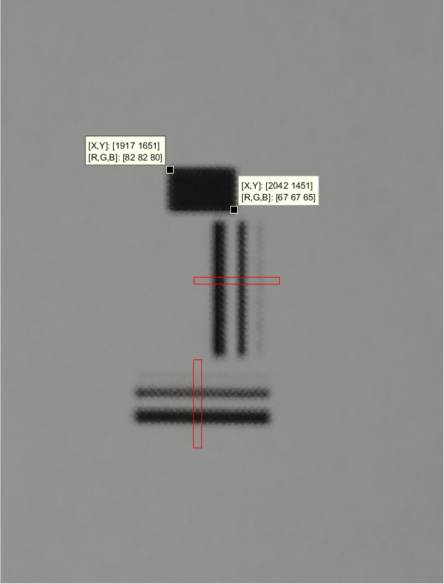
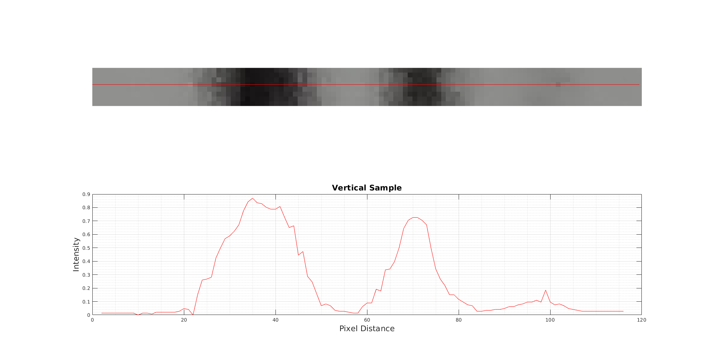
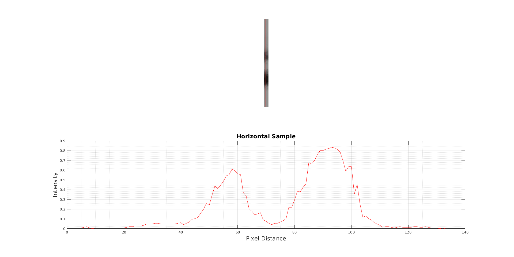
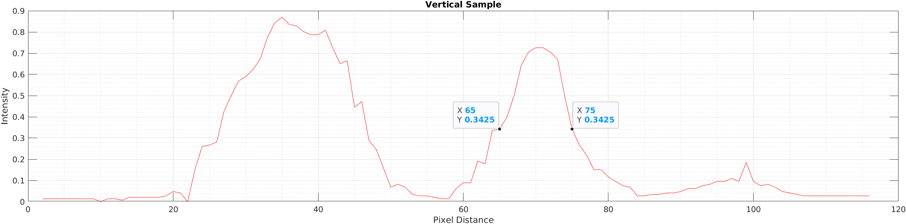
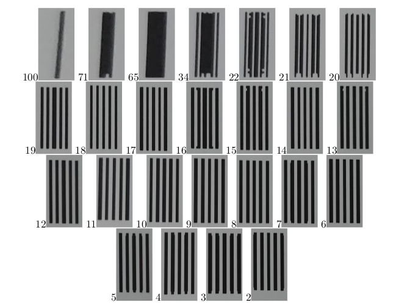
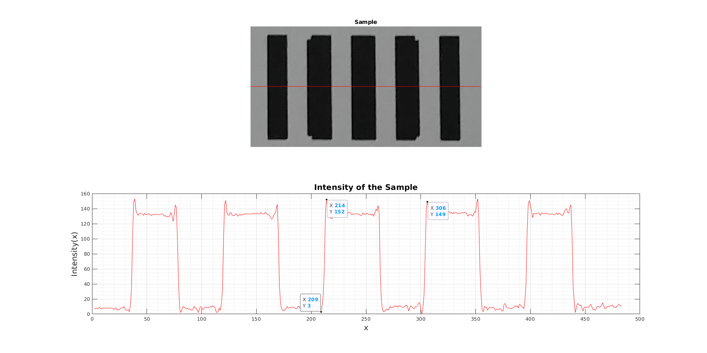
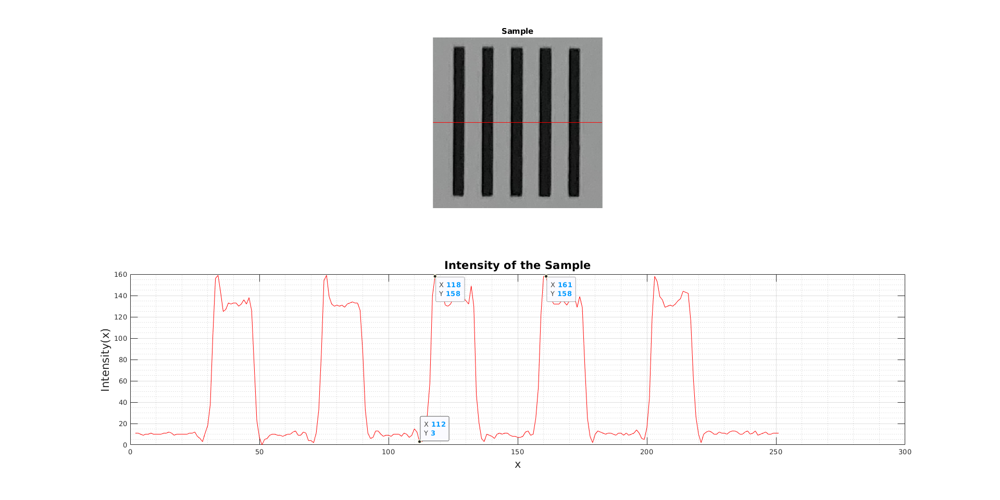
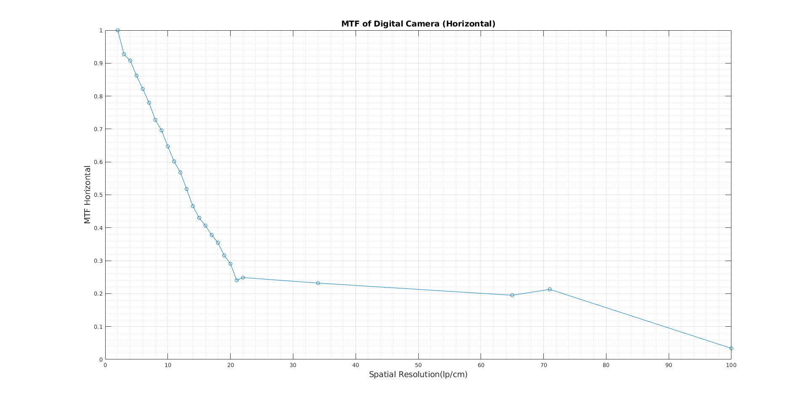
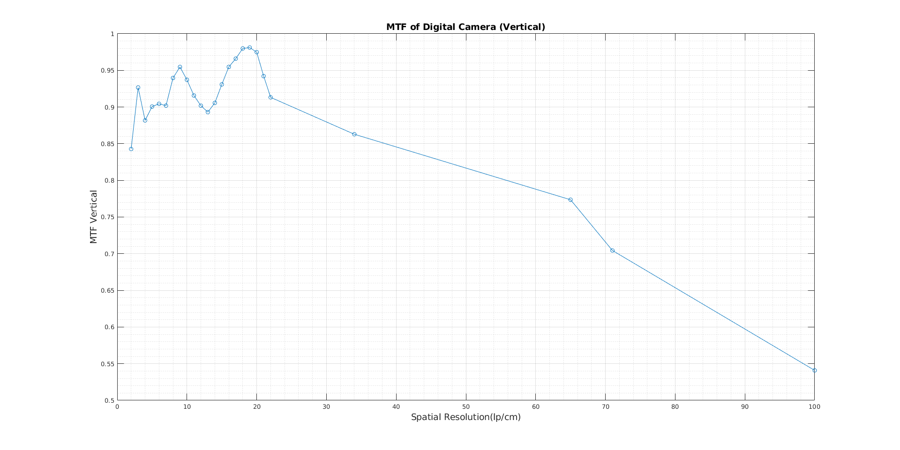

# Measurement-of-LSF-and-MTF-of-a-Digital-Camera

## Introduction
### Summary
The Line Spread Function (LSF) and Modulation Transfer Function (MTF) of the LG-H870 smartphone camera are measured in this study. Mathematica 12.1.1 is used to design the objects. For the LSF, evenly spaced objects consisting of binarized black and white stripes with different widths are created. For the MTF, objects with both uniform and varying widths at actual size are designed, also black and white stripes, with actual size referring to computer designs based on pixels and objects made with physical measurements in millimeters. These objects are printed with measurements in millimeters. Subsequently, photographs of the objects are taken using the smartphone camera in automatic mode, without zoom or flash, and the images are saved as RAW JPEG files. Small samples are extracted from the images in Paint due to the large amount of information in the full photos and limited computing power. The analysis of these samples is performed in MATLAB R2020a. The LSF and MTF are calculated by plotting pixel intensities from grayscale images against their pixel values.

## Line Spread Function(LSF)

### Methods of Experiment

A test image (Figure 1) is prepared in Mathematica 12.1.1. All objects are scaled. This test image includes three vertical and horizontal lines with widths of 1 mm, 0.5 mm, and 0.1 mm, as well as a rectangle measuring 5 mm × 3 mm. Evenly spaced stripes at actual size are created, and then the widths of the stripes are adjusted.

### Mathematica Code For Real-Size Object Generation

```mathematica
(* Pixel to mm conversion *)
mm = 7.2/2.54;

(* Define stripe widths and positions *)
a = {0, 5, 6, 7, 7.5, 8.5} mm;
c = {5, 6, 7, 7.5, 8.5, 8.6} mm;
b = 0 mm;
d = 10 mm;
color = {White, Black, White, Black, White, Black};

(* Create graphics with controllable stripe widths *)
graphics = Show[
  Graphics[
    Table[
      Style[Rectangle[{Part[a, x], b}, {Part[c, x], d}], Part[color, x]], 
      {x, 1, 6}
    ]
  ]
];

(* Export horizontal stripes *)
Export["plot.png", 
  Binarize@ImageResize[graphics, {8.6 mm, 10 mm}]
];

(* Export vertical stripes *)
Export["plot1.png", 
  Rotate[Binarize@ImageResize[graphics, {8.6 mm, 10 mm}], Pi/2]
];

(* Export rectangle *)
Export["plot2.png", 
  Binarize@ImageResize[Graphics[Rectangle[]], {5 mm, 3 mm}]
];
```

Designed objects in [mm] dimensions are pictures taken by the camera. In this process, the dimensions are changed. Currently, image dimensions are in pixels. By using the actual size (mm) of the object and the ratio of the object's pixel size, the dimensions can be converted.

### Estimating Pixel to mm Conversion

Pixel-to-mm conversion is estimated using the corner points of the rectangle in Figure 2. By calculating the ratio of the rectangle's actual size to the pixels detected by the camera, the pixel to mm conversion is estimated as follows.


Figure: Test Image Taken by Camera, Image Size 3120 x 4160 pixels


This means approximately 41 pixels per millimeter are present. With this ratio, both dimensions can be utilized. A small sample (red region in Figure 2) is taken with paint from the entire picture and is analyzed using MATLAB. This is because enough equipment to analyze the whole picture is not available. While several methods could analyze the entire image, a slice of the picture is sufficient to calculate the line spread function.

### Finding Intensity Profile of Images
Information about the intensities of pixels in the sample image is needed.

### MATLAB Code for Finding Intensity and Pixels

Small samples were taken from Figure 1 using paint, as shown in Figure 2. Plotting the intensities of small samples of grayscale image pixels in the vertical and horizontal directions produces the intensity profile of the image.

```matlab
clear all, close all, clc

% Read image data
I = imread('verticaldata.png');
% I = imread('horizontaldata.png');  % Alternative: horizontal data

% Define profile line for vertical sample
x = [0 size(I,2)];
y = [size(I,1)/2 size(I,1)/2];

% Alternative: for horizontal sample
% y = [0 size(I,1)];
% x = [size(I,2)/2 size(I,2)/2];

% Extract intensity profile
c = improfile(I,x,y);

% Display results
figure
subplot(2,1,1)
imshow(I)
hold on
plot(x,y,'r')

subplot(2,1,2)
plot(-c(:,1,1)/max(c(:,1,1))+1,'r')  % Normalized intensity
hold on
xlabel("Pixel Distance")
ylabel("Intensity")
title("Vertical Sample")
grid on
grid minor
```

### Output of the program



Figure 2: Vertical Sample taken from Horizontal Stripes



Figure 3: Horizontal Sample taken from Vertical Stripes

As can be seen in the graphs, the intensity of the 0.1mm width is almost impossible to detect. In the horizontal sample, its intensity is not observed, and in the vertical sample, a small peak is present. The line appears to have been undetected by the camera due to its low opacity and the printer's low DPI.


### Estimating Standart Deviation(σ)

To calculate FWHM, the second peak (0.5mm peak) in the vertical sample is selected, as it resembles a Gaussian function more closely than the others.



Using a conversion of 40.84 px/mm, the standard deviation (σ) is calculated as follows:


Another way to approach this is that the peak value of the second peak is 106. σ can be calculated from this peak value.


### Conclusions
How well an optical system forms sharp images is measured by the line spread function (LSF). As is shown in the graphs, a narrower bandwidth is better for resolving images. Consequently, in a wider bandwidth (FWHM) system, lines may not be distinguishable. 

The distinguishability of physical features is measured by FWHM. In our system, some features can be resolved at 0.1 mm due to the sampling medium and test image. If two peaks have overlapping FWHMs, they are unresolvable and are appeared as one peak.

# Modulation Transfer Function(MTF)
## Method of Experiment
A test image is prepared in Mathematica 12.1.1, with all objects at actual size. This test image contains five equidistant vertical black and white stripes, ranging from 100 lp/cm to 2 lp/cm. Initially, the equidistant stripes at actual size are created, and then the widths of the stripes are adjusted.

### Object Design and Experimental Procedure
By using the same Mathematica code, test images at actual size are generated.

Every five stripes form an object. Each object is cropped in the paint based on their frequencies to be analyzed individually.



Some samples appear different from the test image due to the low DPI printer. The intensity profiles of these samples are determined, similar to the LSF section.

### Analysis of the Objects

Plotting the intensities of small samples of grayscale image pixels in the horizontal direction provides the intensity profile of the image.

```matlab
clear all, close all, clc

% Read sample image
I = imread('*.bmp');

% Define horizontal profile line
x = [0 size(I,2)];
y = [size(I,1)/2 size(I,1)/2];

% Extract intensity profile
c = improfile(I,x,y);

% Display sample and intensity profile
figure
subplot(2,1,1)
imshow(I)
title("Sample")
hold on
plot(x,y,'r')

subplot(2,1,2)
plot(-c(:,1,1)+max(c(:,1,1)),'r')
hold on
xlabel("x", "FontSize", 16)
ylabel("Intensity(x)", "FontSize", 16)
title("Intensity of the Sample", "FontSize", 16)
grid on
grid minor
```
## Analysis
### Modulation Transfer Function determination of objects
### Analysis of the Object 7lp/cm

### Analysis of the Object 18lp/cm


Peak-to-peak variations in some samples shown in Figure 8 are observed. The other 24 samples are analyzed in exactly the same manner as these two samples. In both horizontal and vertical directions, peak-to-peak variations determine Spp (vertical) and Spp (horizontal) values. By using these values, the modulation transfer function can be derived.

## Graphs & Noise Equivalent Bandwidths

Plotting spatial resolution against the S pp values provides the modulation transfer function (MTF) in both horizontal and vertical directions. MATLAB's `enbw` (equivalent noise bandwidth) function computes the noise equivalent bandwidth values.

```matlab
close all, clear all, clc

% Spatial resolution data (lp/cm)
x = [2:22, 34, 65, 71, 100];

% Spp (Vertical) - peak-to-peak values
y1 = [134, 150, 158, 125, 134, 149, 153, 156, 155, 146, 135, 136, 145, ...
      148, 156, 155, 155, 154, 159, 157, 150, 129, 131, 119, 86];
y1 = y1/max(y1);  % Normalize with max value

% Spp (Horizontal) - peak-to-peak values
y2 = [119, 108, 104, 110, 99, 92, 84, 79, 79, 80, 63, 57, 59, 49, 49, ...
      42, 43, 42, 35, 26, 27, 13, 47, 25, 4];
y2 = y2/max(y2);  % Normalize with max value

% Calculate noise equivalent bandwidth
n_e_vertical = enbw(y1)
n_e_horizontal = enbw(y2)

% Plot MTF - Vertical
figure
y1 = smooth(y1);
plot(x, y1, '-o')
title("MTF of Digital Camera (Vertical)", "FontSize", 14)
xlabel("Spatial Resolution (lp/cm)", "FontSize", 14)
ylabel("MTF Vertical", "FontSize", 14)
grid on
grid minor

% Plot MTF - Horizontal
figure
y2 = smooth(y2);
plot(x, y2, '-o')
title("MTF of Digital Camera (Horizontal)", "FontSize", 14)
xlabel("Spatial Resolution (lp/cm)", "FontSize", 14)
ylabel("MTF Horizontal", "FontSize", 14)
grid on
grid minor
```
### Program Output


## Modulation Transfer Functions




# Conclusions
In this experiment, the Modulation Transfer Function of the smartphone camera is determined using 25 objects ranging from 100lp/cm down to 2lp/cm. The response of an optical system to low and high spatial frequencies is measured by the modulation transfer function. How the spatial frequency of the objects affects the spatial resolution of the smartphone camera is analyzed.

Measurement, the tools used, and the medium are very important in this experiment. Because of the low light, the medium intensity values are small. Additionally, due to the low DPI of the printer used, the sampling process is not very efficient.

The MTF in the horizontal direction is strictly decreasing as is expected because the spatial frequency of the objects is decreasing. In Figure 9.b, fluctuations in the MTF in the vertical direction are present. The sampling process is probably not very efficient in the experiment. The low light level in the room, low DPI printed paper, camera angle, and reflections contribute to these errors. When the spatial frequency is lower, objects are distinguishable and do not interact with each other; therefore, peak-to-peak variations are not affected that much. However, if the spatial frequency of the objects increases, they become indistinguishable. The spatial resolution of the optical device is, of course, important here, but the intensity of the objects is still affected by it.

The camera's noise equivalent bandwidth values are 1.0129 for vertical and 1.2676 for horizontal.

# Licence
The project is released under licence: the GPL version 3 license.

Using without reference is, among other things, against the current license agreement (GPL).

Scientific or technical publications resulting from projects using this code are required to cite.

