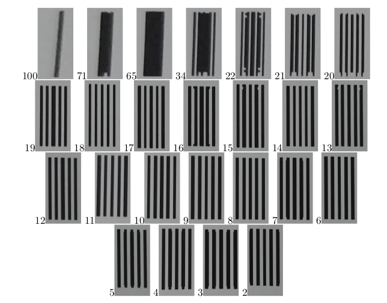

# Measurement-of-LSF-and-MTF-of-a-Digital-Camera

## Introduction
### Summary
In this work, I aimed to find the Line Spread Function (LSF) and Modulation Transfer Function (MTF) of my smartphone. I designed objects using the Mathematica 12.1.1 program. For the LSF, I created equidistant objects (binarized white and black stripes) of varying widths, and for the MTF, I designed equidistant objects (binarized white and black stripes) with both consistent and differing widths in actual size. Actual size refers to computer designs based on pixels, and I created the objects in real-life measurements in millimeters. Then, I printed these objects with dimensions in millimeters. Next, I photographed the objects with my smartphone camera in Automatic mode, without using zoom or flashlight, and saved the images as RAW JPEG files, transferring them to my computer with a data cable to prevent data loss. To analyze the images, I extracted small samples using Paint because the full image contains a lot of information, and I do not have sufficient computing power for that. The samples were analyzed in MATLAB R2020a. By plotting graphs of the intensities of pixels from grayscaled images against the pixel values, I calculated the LSF and MTF.

## Line Spread Function(LSF)

### Methods of Experiment

A test image (Figure 1) is prepared in Mathematica 12.1.1. All objects are to scale. This test image includes three vertical and horizontal lines with widths of 1 mm, 0.5 mm, and 0.1 mm, as well as a rectangle measuring 5 mm × 3 mm. First, I created evenly spaced stripes at actual size, and then I adjusted the widths of the stripes.

### Mathematica Code For Real-Size Object Generation
```Mathematica
mm = 7.2/2.54; (*Convert pixel to mm*)
a = {0, 5, 6, 7, 7.5, 8.5} mm; (*widths*)
c = {5, 6, 7, 7.5, 8.5, 8.6} mm;
b = 0 mm;
d = 10 mm;
color = {White, Black, White, Black, White, Black};
(*By using this method, we can control the widths of the stripes*)
graphics = 
 Show[Graphics[
   Table[Style[Rectangle[{Part[a, x], b}, 
   {Part[c, x], d}], Part[color, x]], {x, 1, 6}]]]
(*Export*)
(*Horizontal Stripes*)
Export["plot.png", 
Binarize@ImageResize[graphics,{8.6 mm, 10 mm}]] 
(*Vertical Stripes*)
Export["plot1.png", Rotate[Binarize@
ImageResize[graphics, {8.6 mm, 10 mm}], Pi/2]] 
(*Rectangle*)
Export["plot2.png", 
Binarize@ImageResize[Graphics[
Rectangle[]], {5 mm, 3 mm}]] 
```

Designed objects in [mm] dimensions are pictures taken by the camera. In this process, the dimensions have changed. Currently, image dimensions are in pixels. By using the actual size (mm) of the object and the ratio of the object's pixel size, we can convert the dimensions. 

### Estimating Pixel to mm Conversion

Pixel-to-mm conversion is estimated using the corner points of the rectangle in Figure 2. By calculating the ratio of the rectangle’s actual size to the pixels detected by the camera, the pixel to mm conversion can be estimated as follows.  


Figure: Test Image Taken by Camera, Image Size 3120 x 4160 pixels


This means there are approximately 41 pixels per millimeter. With this ratio, we can utilize both dimensions. I took a small sample (red region in Figure 2) with paint from the entire picture and analyzed it using MATLAB. This is because I do not have enough equipment to analyze the whole picture. While several methods could analyze the entire image, a slice of the picture is sufficient to calculate the line spread function.

### Finding Intensity Profile of Images
Now we need information about the intensities of pixels in the sample image.

### Matlab Code for Finding Intensity and Pixels
Small samples were taken from Figure 1 using paint, as shown in Figure 2. Plotting the intensities of small samples of grayscale image pixels in the vertical and horizontal directions produces the intensity profile of the image.

```Matlab
clear all, close all, clc

I = imread('verticaldata.png');
%I = imread('horizontaldata.png'); 

x = [0 size(I,2)];
y = [size(I,1)/2 size(I,1)/2];
%y = [0 size(I,1)];
%x = [size(I,2)/2 size(I,2)/2];

c = improfile(I,x,y);
figure
subplot(2,1,1)
imshow(I)
hold on
plot(x,y,'r')
subplot(2,1,2)
plot(-c(:,1,1)/max(c(:1,1))+1,'r') %Normalized
hold on
xlabel("Pixel Distance")
ylabel("Intensity")
title("Vertical Sample");grid on ;grid minor
```

### Output of the program


Figure 2: Vertical Sample taken from Horizontal Stripes


Figure 3: Horizontal Sample taken from Vertical Stripes

As we can see in the graphs, the intensity of the 0.1mm width is almost impossible to detect. In the horizontal sample, we do not observe its intensity, and in the vertical sample, there is a small peak. It appears the camera failed to detect the line due to its low opacity and the printer’s low DPI.


### Estimating Standart Deviation(σ)

To calculate FWHM, it’s simple to select the second peak (0.5mm peak) in the vertical sample, as it resembles a Gaussian function more closely than the others.


Using a conversion of 40.84 px/mm, we calculate the standard deviation (σ) as follows:


Another way to approach this is that the peak value of the second peak is 106. We can calculate σ from this peak value. 


### Conclusions
Line spread function (LSF) measures how well an optical system forms sharp images. As shown in the graphs, a narrower bandwidth is better for resolving images. Consequently, in a wider bandwidth (FWHM) system, lines may not be distinguishable. 

FWHM measures the distinguishability of physical features. In our system, some features can be resolved at 0.1 mm due to the sampling medium and test image. If two peaks have overlapping FWHMs, they are unresolvable and will appear as one peak.

# Modulation Transfer Function(MTF)
## Method of Experiment
A test image is prepared in Mathematica 12.1.1, with all objects at actual size. This test image contains five equidistant vertical black and white stripes, ranging from 100 lp/cm to 2 lp/cm. Initially, I created the equidistant stripes at actual size, and then adjusted the widths of the stripes.

### Object Design and Experimental Procedure
By using the same Mathematica code, we generate test images at actual size.

Every five stripes form an object. I cropped each object in the paint based on their frequencies to analyze them individually.



Some samples appear different from the test image due to the low DPI printer. We will determine the intensity profiles of these samples, similar to the LSF section.

### Analysis of the Objects
Plotting the intensities of small samples of grayscale image pixels in the horizontal direction provides the intensity profile of the image.

```Matlab
clear all, close all, clc

I = imread('*.bmp');

x = [0 size(I,2)];
y = [size(I,1)/2 size(I,1)/2];
c = improfile(I,x,y);
figure
subplot(2,1,1)
imshow(I)
title("Sample")
hold on
plot(x,y,'r')
subplot(2,1,2)
plot(-c(:,1,1)+max(c(:,1,1)),'r')
hold on

xlabel("x","FontSize",16)
ylabel("Intensity(x)","FontSize",16)
title("Intensity of the Sample","FontSize",16)
grid on, grid minor
```
## Analysis
### Modulation Transfer Function determination of objects
### Analysis of the Object 7lp/cm

### Analysis of the Object 18lp/cm


We are observing peak-to-peak variations in some samples shown in Figure 8. The other 24 samples were analyzed in exactly the same manner as these two samples. In both horizontal and vertical directions, peak-to-peak variations determine Spp (vertical) and Spp (horizontal) values. By using these values, we can derive the modulation transfer function.

## Graphs & Noise Equivalent Bandwiths
Plotting spatial resolution against the S pp values provides the modulation transfer function (MTF) in both horizontal and vertical directions. MATLAB’s enbw (equivalent noise bandwidth) function computes the noise equivalent bandwidth values.

```Matlab
close all, clear all, clc
%Spatial Resolution
x = [2:22,34,65,71,100];
%Spp(Vertical)
y1 = [134,150,158,125,134,149,153,156,155,146,135,136,145,148,156,155,155,154,159,157,150,129,131,119,86];
y1 = y1/max(y1); %Normalized with max value
%Spp(Horizontal)
y2 = [119,108,104,110,99,92,84,79,79,80,63,57,59,49,49,42,43,42,35,26,27,13,47,25,4];
y2 = y2/max(y2); %Normalized with max value

n_e_vertical = enbw(y1)
n_e_vertical = enbw(y2)

figure,
y1=smooth(y1);
plot(x,y1,'-o')
title("
MTF of Digital Camera (Vertical)","FontSize",14)
xlabel("Spatial Resolution(lp/cm)","FontSize",14)
ylabel("MTF Vertical","FontSize",14)
grid on, grid minor
figure,
y2=smooth(y2);
plot(x,y2,'-o')
title("MTF of Digital Camera (Horizontal)","FontSize",14)
xlabel("Spatial Resolution(lp/cm)","FontSize",14)
ylabel("MTF Horizontal","FontSize",14)
grid on, grid minor
```
## Output of the program:


## Modulation Transfer Functions


# Conclusions
 In this experiment, I determined the Modulation Transfer Function of my smartphone camera using 25 objects ranging from 100lp/cm down to 2lp/cm. The modulation transfer function measures the response of an optical system to low and high spatial frequencies. I analyzed how the spatial frequency of the objects affects the spatial resolution of my smartphone camera.  

Measurement, the tools I have used, and the medium are very important in this experiment. Because of the low light, the medium intensity values are small. Additionally, due to the low DPI of the printer I have used, the sampling process is not very efficient. 

The MTF in the horizontal direction is strictly decreasing as expected because the spatial frequency of the objects is decreasing. In Figure 9.b, there are fluctuations in the MTF in the vertical direction. The sampling process is probably not very efficient in my experiment. The low light level in the room, low DPI printed paper, camera angle, and reflections contribute to these errors. When the spatial frequency is lower, objects are distinguishable and do not interact with each other; therefore, peak-to-peak variations shouldn’t be affected that much. However, if the spatial frequency of the objects increases, they become indistinguishable. The spatial resolution of the optical device is, of course, important here, but it still affects the intensity of the objects.  

The camera's noise equivalent bandwidth values are 1.0129 for vertical and 1.2676 for horizontal.

# Licence
Released under licence: the GPL version 3 license.

Using without reference is, among other things, against the current license agreement (GPL).

Scientific or technical publications resulting from projects using this code are required to citate.
